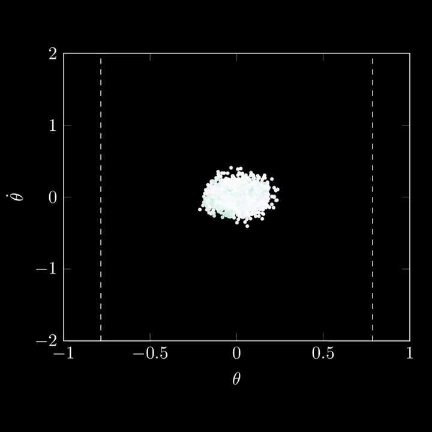
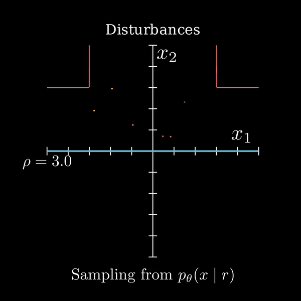
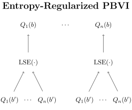
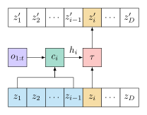
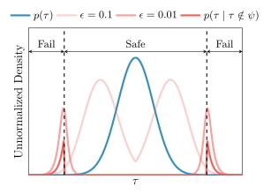

@def title = "Harrison Delecki"
@def tags = ["syntax", "code"]

<!-- \flattoc you can use \toc as well -->

~~~

<!-- I'm an AI researcher focused solving high-stakes, high-impact problems. I am currently an AI/ML scientist at <a href="https://www.terraai.com/">Terra AI</a>, where I develop methods for uncertainty quantification in large-scale sustainable resource projects such as mineral exploration and carbon sequestration. Previously, I was a PhD student at Stanford University and a member of the <a href="https://sisl.stanford.edu/">Stanford Intelligent Systems Laboratory (SISL)</a>. My PhD research focused on sampling and estimation for safety validation of autonomous systems in safety-critical applications, such as self-driving cars and autonomous aircraft. I build upon methods from Bayesian inference, generative modeling and decision making under uncertainty to solve high-impact, high-stakes problems. -->

I'm an AI researcher working on principled approaches to uncertainty, risk, and robust decision-making in complex real-world systems. Currently, I'm the chief scientist at <a href="https://valgo.ai/">Valgo</a>, where I focus on risk quantification for physical AI. I am also an AI/ML scientist at <a href="https://www.terraai.com/">Terra AI</a>, developing uncertainty quantification methods for large-scale sustainable resource projects, including mineral exploration and carbon sequestration. Previously, I earned my PhD at Stanford University, where my research focused on sampling and estimation for safety validation of autonomous systems like self-driving cars and autonomous aircraft.

<!-- At Stanford I was advised by <a href="https://mykel.kochenderfer.com/">Mykel Kochenderfer</a>, and was also a member of the <a href="https://aisafety.stanford.edu/">Stanford Center for AI Safety</a>. During my PhD, I had had the opportunity to work with sponsors such as Ford, Motional, NASA JPL, and Nissan. Prior to my PhD at Stanford I earned by Bachelor's degree from Georgia Tech, where I worked on attitude determination and control for small satellites. -->

At Stanford, I was a member of the <a href="https://sisl.stanford.edu/">Stanford Intelligent Systems Laboratory (SISL)</a> and the <a href="https://aisafety.stanford.edu/">Stanford Center for AI Safety</a>, advised by <a href="https://mykel.kochenderfer.com/">Mykel Kochenderfer</a>. I collaborated with sponsors including NASA JPL, Ford, Motional, and Nissan. Before Stanford, I earned my Bachelor's degree from Georgia Tech, where I worked on attitude determination and control for small satellites.

~~~

# Publications

~~~

<strong>Failure Probability Estimation for Black-Box Autonomous Systems using State-Dependent Importance Sampling Proposals
</strong>

Harrison Delecki, Sydney M. Katz, and Mykel J. Kochenderfer

<em>International Conference on Control, Decision and Information Technologies (CoDIT) 2025</em>

~~~

~~~

<strong>Diffusion Failure Sampling for Evaluating Safety-Critical Autonomous Systems</strong>

Harrison Delecki, Marc R. Schlichting, Mansur Arief, Anthony Corso, Marcell Vazquez-Chanlatte, and Mykel J. Kochenderfer

<em>International Conference on Engineering Reliable Autonomous Systems (ERAS) 2025</em>

~~~

~~~

<strong>Entropy-regularized Point-based Value Iteration</strong>

Harrison Delecki, Marcell Vazquez-Chanlatte, Esen Yel, Kyle Wray, Tomer Arnon, Stefan Witwicki, and Mykel J. Kochenderfer

<em>International Conference on Control, Decision and Information Technologies (CoDIT) 2025</em>

~~~

~~~

<strong>Deep Normalizing Flows for State Estimation </strong>

Harrison Delecki, Liam A. Kruse, Marc R. Schlichting, and Mykel J. Kochenderfer

<em>International Conference on Information Fusion 2023</em>

~~~

~~~

<strong>Model-based Validation as Probabilistic Inference</strong>

Harrison Delecki, Anthony Corso, and Mykel J. Kochenderfer

<em>Learning for Dynamics and Control Conference 2023, <strong>Oral</strong></em>

~~~

~~~

<strong>How Do We Fail? Stress Testing Perception in Autonomous Vehicles</strong>

Harrison Delecki, Masha Itkina, Bernard Lange, Ransalu Senanayake, and Mykel J. Kochenderfer

<em>International Conference on Intelligent Robots and Systems 2022</em>

~~~