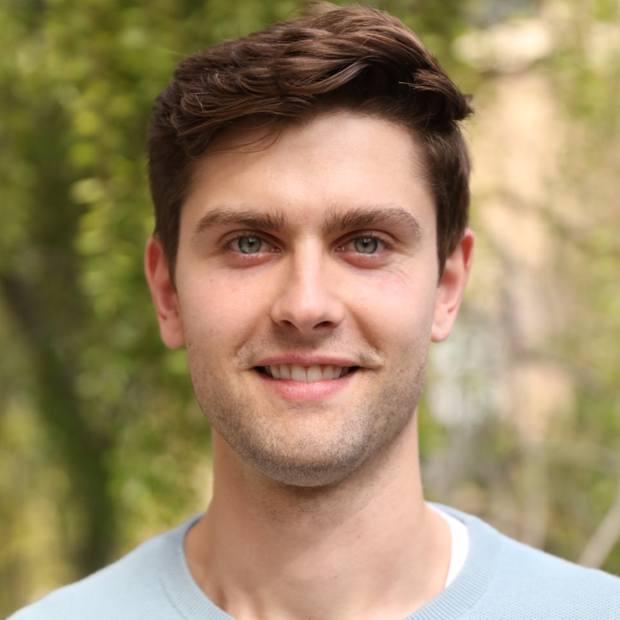

@def title = "Harrison Delecki"
@def tags = ["syntax", "code"]

<!-- \flattoc you can use \toc as well -->

~~~

~~~

~~~

I'm a PhD student at Stanford University and a member of the <a href="https://sisl.stanford.edu/">Stanford Intelligent Systems Laboratory (SISL)</a>. My current research focuses on sampling and estimation for safety validation of autonomous systems in safety-critical applications, such as self-driving cars and autonomous aircraft. I build upon methods from Bayesian inference and generative modeling to evaluate the safety of complex, high-dimensional  autonomous systems.</a>.

At Stanford I am advised by <a href="https://mykel.kochenderfer.com/">Mykel Kochenderfer</a>, and am also a member of the <a href="https://aisafety.stanford.edu/">Stanford Center for AI Safety</a>. During my PhD, I have had the opportunity to work with sponsors such as Ford, Motional, NASA JPL, and Nissan. Prior to my PhD at Stanford I earned by Bachelor's degree from Georgia Tech, where I worked on attitude determination and control for small satellites.

~~~

# Publications

~~~

<strong>Entropy-regularized Point-based Value Iteration</strong>

Harrison Delecki, Marcell Vazquez-Chanlatte, Esen Yel, Kyle Wray, Tomer Arnon, Stefan Witwicki, and Mykel J. Kochenderfer

<em>Under review (2024)</em>

~~~

~~~

<strong>Deep Normalizing Flows for State Estimation </strong>

Harrison Delecki, Liam A. Kruse, Marc R. Schlichting, and Mykel J. Kochenderfer

<em>2023 International Conference on Information Fusion</em>

~~~

~~~

<strong>Model-based Validation as Probabilistic Inference</strong>

Harrison Delecki, Anthony Corso, and Mykel J. Kochenderfer

<em>Learning for Dynamics and Control Conference 2023, <strong>Oral</strong></em>

~~~

~~~

<strong>How Do We Fail? Stress Testing Perception in Autonomous Vehicles</strong>

Harrison Delecki, Masha Itkina, Bernard Lange, Ransalu Senanayake, and Mykel J. Kochenderfer

<em>International Conference on Intelligent Robots and Systems 2022</em>

~~~